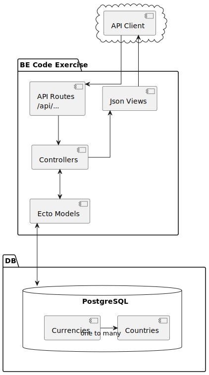

# Documentation

## Original implementation

For posterity, the following diagram displays a basic overview of the be-exercise app in its initial stage.



The application exposes simple CRUD API for `Currency` and `Country` tables in a PostgreSQL Database. 
It follows the architecture of a standard, generated phoenix project. 
`Currencies` and `Countries` are related via a one-to-many relationship. 

## Requirements
- [x] Fix existing bugs in the application
- [x] Create an employee resource
- [x] Seed script
- [x] Salary metrics endpoint


# Usage

As this application grows in complexity, I decided it's suitable to compose frequently run mix tasks into a Makefile where one can easily startup, teardown, cleanup and perform many other operations by running single make commands. It's strongly recommended to take a quick glance at the Makefile to see what each command does. 
You can list all available commands by running:

> `make help`

## Building 

To fetch all deps and compile source, run:
> `make deps`

## Running 

First, set up the database with

> `make db-setup`

The above will automatically run a PostgreSQL DB instance in a docker container, create the exercise DB, run migrations and start up the DB for the following commands. 


To run Exercise app in a development environment
> `make server`

To run Exercise app with an Elixir REPL shell
> `make shell`

## Database

At this stage, the DB will not have any data. You may chose to populate the database with the seed script located in [priv/repo/seeds.exs](/priv/repo/seeds.exs):

> `make db-seed`

If you wish to start fresh, drop everything in the database with:

> `make db-drop`


## Testing

To run all tests
> `make test`

If multiple failures are causing tests difficult to read, run:

> `make test-one`

to see just the first failure. 

## Benchmarking 

Benchmark script is located in [priv/bench/benchmark.exs](/priv/bench/benchmark.exs).
You can run it along with all DB prereqs with:

> `make bench`


# Implementation Details

The BE-Exercise application provides a CRUD interface to its three main resources: Currencies, Countries and Employees. 

The Application diagram below illustrates the Model-View-Controller pattern of this application, as well as Table relationships. 


In addition to the CRUD API, the task required addition of Metrics endpoints which calculates min, max and average salaries for all the Employees stored in the database based on their country and job title.

## Json API

Generated using `mix phx.routes`:

```sh
# Currencies
currency_path  GET     /api/currencies                      ExerciseWeb.CurrencyController :index
currency_path  GET     /api/currencies/:id/edit             ExerciseWeb.CurrencyController :edit
currency_path  GET     /api/currencies/new                  ExerciseWeb.CurrencyController :new
currency_path  GET     /api/currencies/:id                  ExerciseWeb.CurrencyController :show
currency_path  POST    /api/currencies                      ExerciseWeb.CurrencyController :create
currency_path  PATCH   /api/currencies/:id                  ExerciseWeb.CurrencyController :update
               PUT     /api/currencies/:id                  ExerciseWeb.CurrencyController :update
currency_path  DELETE  /api/currencies/:id                  ExerciseWeb.CurrencyController :delete

currency_path  GET     /api/currencies/code/:code           ExerciseWeb.CurrencyController :get_by_code
# Countries
country_path  GET     /api/countries                       ExerciseWeb.CountryController :index
country_path  GET     /api/countries/:id/edit              ExerciseWeb.CountryController :edit
country_path  GET     /api/countries/new                   ExerciseWeb.CountryController :new
country_path  GET     /api/countries/:id                   ExerciseWeb.CountryController :show
country_path  POST    /api/countries                       ExerciseWeb.CountryController :create
country_path  PATCH   /api/countries/:id                   ExerciseWeb.CountryController :update
              PUT     /api/countries/:id                   ExerciseWeb.CountryController :update
country_path  DELETE  /api/countries/:id                   ExerciseWeb.CountryController :delete
# Employees
employee_path  GET     /api/employees                       ExerciseWeb.EmployeeController :index
employee_path  GET     /api/employees/:id/edit              ExerciseWeb.EmployeeController :edit
employee_path  GET     /api/employees/new                   ExerciseWeb.EmployeeController :new
employee_path  GET     /api/employees/:id                   ExerciseWeb.EmployeeController :show
employee_path  POST    /api/employees                       ExerciseWeb.EmployeeController :create
employee_path  PATCH   /api/employees/:id                   ExerciseWeb.EmployeeController :update
               PUT     /api/employees/:id                   ExerciseWeb.EmployeeController :update
employee_path  DELETE  /api/employees/:id                   ExerciseWeb.EmployeeController :delete

# Batch writing 
employee_path  POST    /api/employees/batch_write           ExerciseWeb.EmployeeController :batch_write

# Metrics endpoints
employee_path  GET     /api/employees/metrics_by_country    ExerciseWeb.EmployeeController :metrics_by_country
employee_path  GET     /api/employees/metrics_by_job_title  ExerciseWeb.EmployeeController :metrics_by_job_title
```


## Work 
- Organised the project with the use of Makefile, Changefile and added versioning. Secondly, as the app grew I organised the structure to separate various domains such as documentation, docker compose files and DB storage.

- Improved test coverage for countries and currencies. This helped me identify several bugs in the application. 
- Added validation constraints 
  - unique foreign key
  - delete changeset, made a decision about handling orphaned rows 

- Seed script 


# Further work to complete this application and Production-ready

Due to running short on my self-imposed time constraint (and clashes with personal-life) I have added the following feature/work that I would consider for a feature-complete app. Please understand that this is by no means a complete list.

## Storing Salary (money)
- Currently using integer: should at least create a wrapper that scales by some factor, e.g 100,
- But realistically, should use Decimal or Money type (elixir deps). This was initially implemented in DecimalUtils module. 
- increases complexity of the app, and requires changing the currency conversion service. 
  - I decided that for the purpose of this exercise, it's not necessary to the scope 
  - However in a production environment, one should not deploy an app that handles money using float or any types resulting in loss of precision

- someone can create a currency in the DB that's not supported by the conversion service. 


### TODO Tracking

- [x] Organise repo directory structure:
  - add `priv/docker` dir for storing docker compose files used to launch databses
  - add `docs` and other documentation subdirs containing READMEs, plantuml and generated svg diagrams

- [x] Changelog and version tracking

- [x] Setup docker compose files

- [x] Makefile for easy startup and teardown of containers, tests and app

- [] Environment file: move credentials out of configs and into .env files

- [] Add versioning to json API
  - a simple "version" header to track changes

- [x] Schemas
  - inspect Country - Currency relationship schema
    - [x] Country belongs_to currencies
    - [x] Currency has_many countries
    - [x] Country has_many Employees. Employee belongs_to Country
  - Index fields
    - specific fields only. Faster WHERE queries. 
    - [x] currency code unique
    - [x] country code unique

- [x] **Employee** CRUD
  - [x] Used phoenix generator
    - `mix phx.gen.json Employees Employee employees full_name:string job_title:string salary:integer country:references:countries`
  - [x] add country_id foreign key 
  - [x] Is integer the right type to use for salary?
    - converted to Decimal type
    -  switched back to using an integer for salary, due to growing complexity of the application, currently outside the scope 

- Add ease of use API to fetch records via fields such as `name` and `code`. 
  - An example of this already exists in `get_currency_by_code!/1`

- [x] Add logic to seed 10,000 employees into the DB. The key will be to make it fast
  - [x] Separate seeding functionality for maintainability of seeds.exs
  - [x] Concurrent batch_write. Speeds up bullk insert of records

- [] **Logging**  application logging 
  - Logging is currently bare bones

- [] **Application** monitoring in production

- [x] **Testing**
  - [x] expand current solution test coverage
    - [x] Currency
    - [x] Country
      - [] preload currency
    - [x] Added Data integrity tests to ensure countries and currencies cannot be added twice. 
    - [x] Ensured that records cannot be orphaned when a currency is associated to countries. 
    - [] Ensured that currency foreign key reference cannot be udpated as this will impact meaning of salary field in employee table. 
    - [x] Employee
      - [x] preload
        - update view to show currency in which the salary is paid!
      - [x] query
  - improve error handling and test coverage

- [x] **Metrics** endpoints
  - [x] fetch salary stats given country (min, max, mean)
  - [x] fetch salary stats given job title (mean)

- [x] **Simple cache**
  - [x] add a simple cache service wrapper around metrics controller 

- [x] **Benchmarking**. 
  - [] How does it scale under increasing vars such as Num Records in DB, concurrent connections...
  - [x] inserts
  - [] reads
  - [] fetch stats endpoint

- [] **Load** testing using (hey)[https://github.com/rakyll/hey] or apache benchmark http tool

- [] **Profiling** with fprof 

- [x] **Documentation**. Ensure @spec and doc comments are provided on all API (with examples where relevant)
  - [x] Generate initial app diagram
  - [] Diagrams: generate sequence diagrams for API
    - [] Supervision tree and module hierarchy
    - [] DB Model
  - [x] Document API. Usage and possible returns
  - [x] seed.exs script usage
    - added help command and module doc

## Exploring optimizations and Design decisions

- [x] **Resolving deletes** on rows with foreign key references, such as deleting a Currency with a Country reference. 
  Options:
  - allow delete: dangling rows with no foreign key reference will need to be handled in application
  - safe delete: only if all children of parent have been removed and no FK references exist. 
  - **Decided** to go with :restrict option :on_delete. This will prevent orphaning records. 

- [x] **batched inserts** 
  - current insert takes too long to seed database with hundreds of thousands of records
  - add endpoint to batch_write multiple employee records. Options:
    - Pass in collectable and write multiple employees in one request. 
      - return success and failure lists, so that client can fix and retry
    - could expose insert_all for even faster writes, but doesn't perform validation. Should not expose this to web API. 
      - extremely fast writes: 100k inserts in 5sec
    - Parallel pipeline: producer->consumer.
      - employee records -> spawn worker pool: perform changeset validation -> DB writers (match pool_size): Repo.insert 
      - Task.async_stream -> insert_all
  - **solution:**
    - **batch_write**: accepts a list of employee attributes, validates and performs insert. 
      - using Task.async_stream in parallel, with :pool_size number of workers. Easiest, and readable way to spawn worker pool.
    - **batch_write_unsafe**: accepts a list of employee attributes, however, json API is forbidden and only the `seeds.exs` script is allowed to use it. This is because it uses insert_all which doesn't perform any validation.
      - splits input into mini batches as postgresql has a parameter limit 


- **Employee** table: Consider DB relationship between Employees and Countries. https://hexdocs.pm/ecto/associations.html 
  - Country (one to many) Employee
  - What data type should I use to store salaries. Consider deps: https://hexdocs.pm/money/readme.html#full-list
  - What options are there to optimise queries on fetching employees given country, or title.
  - Most importantly, what currency should I store the salary field as?
    * 1) Currency local to the Employee's country
      - Convert currency on READ. 
      - **Pros**:
        - Logical solution: currency is already stored in the Currency table by association.
        - No need to convert salary back into Employee's local currency, which can change based on the conversion rate. 
      - **Cons**: 
        - Must convert salary to a common currency on metrics endpoint, which will slow down aggregates. 
    * 2) Common currency, such as USD for all Employees.
      - **Pros**: 
        - Simpler and faster aggregates (min, max, avg and other future) calculations
      - **Cons**: 
        - Must convert employee salaries on every WRITE. 
        - Potential Inconsistency: e.g. If two employees are being hired at the same salary but the currency conversion rate changes in between DB WRITEs, then one employee will be paid slightly less while the other slightly more! This can be resolved by storing historical currency changes but increases complexity. 
    * **Decision**: The answer depends entirely on the purpose of this application. If performance of the metrics endpoint is the ultimate concern then converting salaries on writes will be more suitable, especially if this application will reach an external Currency conversion service in the future. However this comes at a cost, as mentioned above, and so for data accuracy and consistency reasons I decide to store Employee Salaries in their local currency. 

- **Metrics endpoints**:
  - [x] per_country_salary(country) -> {currency_code_, average, min, max}
    - Performing min, max and average on the database
  - per_title_salary(job_title, currency // "USD") -> average
    - currency conversion!

- [x] **Metrics cache**: 
- Employee metrics record is currently the only place this app is going to do **work** (calculations). Therefore we should store this work in a cache for faster retrieval
  - In-memory Cache options: 
    - Gen servers & state
  - Consider ways to **invalidate** the cache.
    - Time expiry. Can cause served data to be stale
    - Event listener / monitor that will invalidate cache if e.g. new employee has been added. 
      - what if another application makes changes to the DB? should I assume that only this app can alter DB? 
        - Manually invalidate cache on writes. Pubsub mechanism & Gen server pool
        - postgresql notify 
  - **ETS**:
    - simple cache wrapper around ETS with a supervisor process table owner, simple_cache:start(:employee_salary_metrics)
    - set, public, read_concurrency, true as I expect read bursts and infrequent writes. 
    - something like: {cache_key, {cache_value, insert_datetime}}
    - Employee insert/delete invalidate all Employee cache values

## Future considerations
- **Distributed sys**: 
  - Reasons to make a distributed application:
    - Future metrics endpoints might be work heavy
      - metrics work can be load balanced and distributed among nodes, then results stored in a shared cache. 
  - Reasons not to:
    - simple CRUD API, an interface to DB won't benefit from multiple nodes. Read and write limited by DB
    - increased complexity
      - should break up the app into smaller microservices. Assign hardware to each app's advantage
        - CRUD API. Lightweight
        - Metrics workers. Faster/More CPUs
        - Key-Value caches. Caches should be given more RAM.

  - Distributed key-value store as cache instead of ETS (local only)
  - third party service such as redis, varnish

- Cache layer for reads such as Varnish Cache

- CQRS pattern: separate read and write operations
